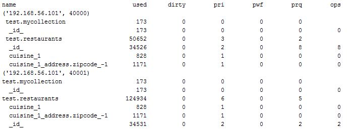

Reporting tool for mongoDB
===========================
##### mongo-collstat:

 Gathers memory usage metrics for collections and indexes. Auto discovers replica set members:

 Just add in your hostname and port for the primary instance on line 5
 
  ```python
  $:> collstats.py -host 192.0.0.1 -port 40000 -d test -c restaurants -discover
```


 
* name = db.collection_name or index name (if indented)
* used = bytes currently in the cache
* dirty = tracked dirty bytes in the cache
* pri = pages read into cache
* pwf = pages written from cache
* prq = pages requested from the cache
```python 
optional arguments:
  -h, --help            show this help message and exit
  -host HOST            hostname
  -port PORT            port number
  -db DATABASE_NAME     database_name
  -coll COLLECTION_NAME
                        collection name
  -discover             Discover repset members
```
    
### Required packages

pip install pymongo
pip install argparse
  
### Requirments

 Mongodb running wired tiger storage engine
 


